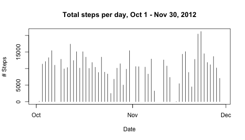
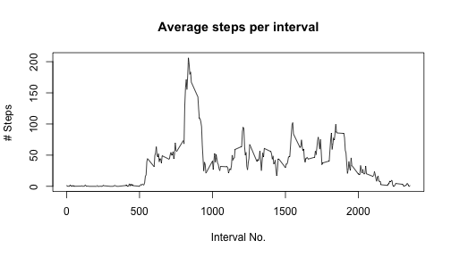
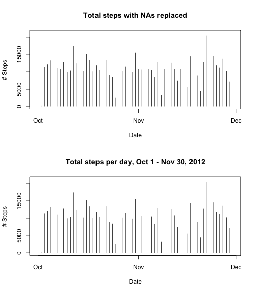

Reproducible Research: Peer Assessment 1
========================================

Course: Coursera/Johns Hopkins, "Reproducible Research" with R.D. Peng <br>
Author: S. Massie

<br>

##0. Introduction

**Goal:** The goal is to explore patterns of behavior in a single individual's footsteps throughout the day. 

**Data:** Data was collected from one individual's personal tracking device over Oct 1-Nov 30, 2012, and consists of the total number of steps by date and 472 evenly spaced "intervals" through the day.

**Methods:** Some simple transformations and plots were used to compare the number of steps by date, by interval, and on weekends vs. weekdays.  The impact of filling in NA values based on the interval mean was also explored.

**Results:** Analysis shows heightened activity in certain date ranges (i.e., December), early in the morning, and on weekends.  Filling in NA values affected the median, but not the mean values.

<br>

##1. Get and clean data

Load data into system.  Assumes that file is already in the working directory.

```r
act <- read.csv("activity.csv")
```

Convert "date"  column to POSIX.ct date format:

```r
act <- transform(act, date = as.POSIXct(date, "%Y-%m-%d", tz = ""))
```
    
<br>

##2. Explore number of steps per day

Create summary table of total steps by day:

```r
library(dplyr)

act         <- group_by(act, date)
act_bydate  <- summarize(act, steps = sum(steps))
```
    
Ignore NA values for now.

Create histogram of number of steps per day: 

```r
with(act_bydate, 
        plot(date, steps, type="h", xlab = "Date", ylab = "# Steps",
             main = "Total steps per day, Oct 1 - Nov 30, 2012") 
    )
```

 

Mean steps per day:

```r
mean(act_bydate$steps, na.rm = TRUE)
```

```
## [1] 10766.19
```

Median steps per day:

```r
median(act_bydate$steps, na.rm = TRUE)
```

```
## [1] 10765
```

<br>

##3. Explore number of steps by interval.

Create summary table of average steps by interval:

```r
act     <- group_by(act, interval)
act_int <- summarize(act, steps = mean(steps, na.rm = TRUE))
```

Plot average steps per interval: 

```r
with(act_int, 
        plot(interval, steps, type="l", xlab = "Interval No.", ylab = "# Steps",
             main = "Average steps per interval") 
    )
```

 

Interval with maximum number of steps:

```r
s_max <- max(act_int$steps, na.rm = TRUE)
i_max <- act_int[act_int$steps==s_max,]$interval
```

- Interval 835 has the greatest average steps with 206 steps.    

<br>

##4. Explore missing values

Calculate number of missing values:

```r
nas <- sum(is.na(act$steps))
```

- There are 2304 NAs out of 17568 observations.

Fill in NA values based on average value for that interval. 

```r
# Join all data with average-by-interval data
temp <- merge(act, act_int, by = "interval", all.x = TRUE)

# Replace NA values with average values
for(i in 1:nrow(temp)){
    if(is.na(temp$steps.x[i])){
        temp$steps.x[i] <- temp$steps.y[i]
    }
}

# Copy to new table
nact <- data.frame(steps=temp$steps.x, date=temp$date, interval=temp$interval)
```

Create summary table of total steps by day, using same steps as before.

```r
nact         <- group_by(nact, date)
nact_bydate  <- summarize(nact, steps = sum(steps))
```

Create histogram of number of steps per day, comparing 2 charts

```r
par(mfcol = c(2,1))

with(nact_bydate, 
        plot(date, steps, type="h", xlab = "Date", ylab = "# Steps",
             main = "Total steps with NAs replaced") 
    )

with(act_bydate, 
        plot(date, steps, type="h", xlab = "Date", ylab = "# Steps",
             main = "Total steps per day, Oct 1 - Nov 30, 2012") 
    )
```

 

Mean steps per day:

```r
mean(nact_bydate$steps, na.rm = TRUE)
```

```
## [1] 10766.19
```

Median steps per day:

```r
median(nact_bydate$steps, na.rm = TRUE)
```

```
## [1] 10766.19
```

The mean value is unchanged but the median has increased by 1.19 steps.    

<br>

##5. Compare activity patterns for weekdays vs. weekends.

Add weekend factor column to dataset with filled-in missing values

```r
nact <- mutate(nact, weekpart = "weekday")

a <- weekdays(nact$date) == "Saturday"| weekdays(nact$date) == "Sunday"
nact[a,]$weekpart <- "weekend"

nact$weekpart <- as.factor(nact$weekpart)
```

Create summary table of average steps by interval and weekend/weekday factor

```r
nact     <- group_by(nact, interval, weekpart)
nact_int <- summarize(nact, steps = mean(steps, na.rm = TRUE))
```

Plot average number of steps for weekend vs. weekday

```r
library(lattice)
xyplot(steps ~ interval | weekpart, data = nact_int, type = "l", layout = c(1,2))
```

 

Weekends show heightened activity overall, while weekdays show a spike of activity in the early morning.  
